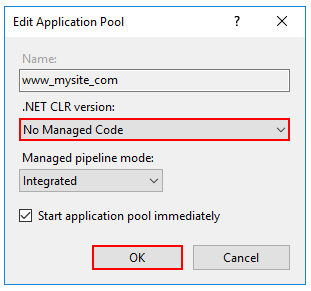
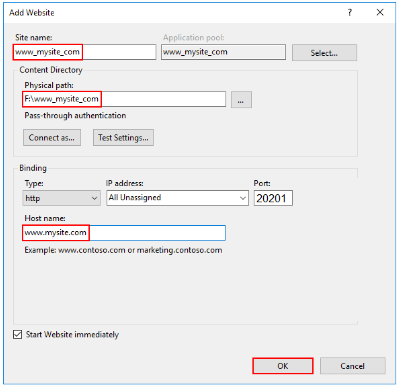
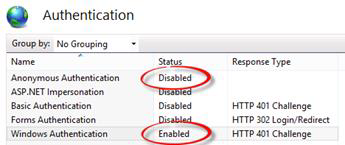

# Standard Bank Concession Management System - Synergy

The RIM application is responsible to managing incoming SABRIC, Court Order, Subpoena and EXCON requests.

## Built With

* Angular
* .NET Core
* SQL

## Contributers

* Heathesh Bhandari - Original Developer
* Wilco Swanepoel - Developer
* Jaco van Schalkwyk - UX

## Getting Started

These instructions serves as a guide to deploy the Concession Management System (Synergy) to a UAT or PROD environment.

## Prerequisites

What things you need to install the software and how to install them

Web Server (IIS)
  - Common HTTP Features
    - Default Document
    - Directory Browsing
    - HTTP Errors
    - Static Content

  - Health and Diagnostics
    - HTTP Loggin

  - Performance
    - Static Content Compression

  - Security
    - [Microsoft Visual C++ 2015 Redistributable Update 3](https://www.microsoft.com/en-us/download/details.aspx?id=53840) 
    - [.NET Core Windows Server Hosting bundle](https://go.microsoft.com/fwlink/?linkid=848766) 

  - If the server has a firewall, please ensure that port 20201 (port number can be changed if required) is opened for HTTP traffic on the server.


## Copy Files

Create a folder on the production server for the application, and copy the files from the UAT server to the production server.

- Edit the “appSettings.json” and change the connection strings accordingly and
set the path for the log files in the “LogFileFolder” setting.

- Ensure that the log file exists.
- Edit the “web.config” and change the process path to “C:\Program Files\dotnet\dotnet”

```
<aspNetCore processPath="C:\Program Files\dotnet\dotnet" arguments="%LAUNCHER_ARGS%" stdoutLogEnabled="false" stdoutLogFile=".\logs\stdout" forwardWindowsAuthToken="true" />
```


## Setup IIS

- Create an application pool. Set the application pool to “No Managed Code”



- Create a website, set the port of the website to 20201, and use the application pool created above:
  - Host should be left blank



- Set the website to use Windows Authentication



## Run Solution
You should be able to run the application by accessing: http://[servername]:20201/.

- You will need to be a registered user in the application (i.e. your “A Number” must be in the database tblUsers table and you must have roles etc. setup) before you will be able to access the site.

- If there are any issues check the log file folder setup in 5.1. mentioned above for any error messages.

- If there are no log file messages check if you can access the following URLs:

  - **http://[servername]:20201/api/Application/LoggerTest** - This should write to the log file.
  - **http://[servername]:20201/api/Application/UserIdentity** - This should bring back the user name of the logged in user, if this is not your “A Number” then the authentication is not working.
  - **http://[servername]:20201/api/Application/LoggedInUser** - This should bring back a json payload of the logged in user’s details and roles etc.